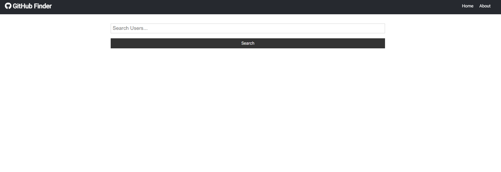
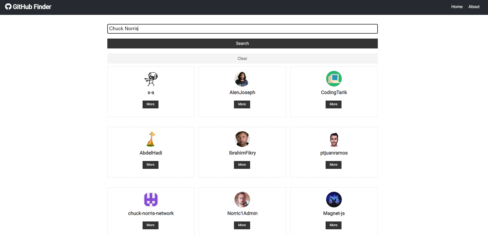
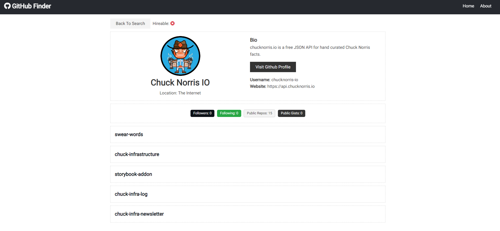

# Github Finder

> A project using the GitHub REST API to search for users and get profile data

Built using React 16 with the Context API along with the useContext and useReducer hooks for state management

# Project Images

<p align="center">



</p>

# Packages

```
├── axios@0.18.1
├── react-dom@16.8.6
├── react-router-dom@5.0.0
├── react-scripts@3.0.1
└── react@16.8.6
```

# Project Structure

```
GitHub-Finder
├── node_modules
|   └── ...
├── public
│   ├── favicon.ico
│   ├── index.html
│   ├── logo192.png
│   ├── logo152.png
│   ├── manifest.json
│   └── robots.txt
├── src
│   ├── components
|   |   ├── layout
|   |   |   ├── Alert.js
|   |   |   ├── Navbar.js
|   |   |   ├── spinner.gif
|   |   |   └── Spinner.js
|   |   ├── pages
|   |   |   ├── About.js
|   |   |   ├── Home.js
|   |   |   └── NotFound.js
|   |   ├── repos
|   |   |   ├── RepoItem.js
|   |   |   └── Repos.js
|   |   └── users
|   |   |   ├── Search.js
|   |   |   ├── User.js
|   |   |   ├── UserItem.js
|   |   |   └── Users.js
│   ├── context
|   |   ├── types.js
|   |   ├── alert
|   |   |   ├── alertContext.js
|   |   |   ├── alertReducer.js
|   |   |   └── AlertState.js
|   |   └── github
|   |       ├── githubContext.js
|   |       ├── githubReducer.js
|   |       └── GithubState.js
│   ├── App.css
│   ├── App.js
│   └── index.js
├── .env
├── .gitignore
├── package-lock.json
├── package.json
├── yarn.lock
└── README.md
```

# GitHub REST API

- [GitHub REST API](https://docs.github.com/en/rest)
- [Getting Started](https://docs.github.com/en/rest/guides/getting-started-with-the-rest-api)
- Test using Postman:
  - `https://api.github.com/users` : Get List of Users Array (46)
  - `https://api.github.com/users/mogrady-professional` : Get my GitHub Details
  - `https://api.github.com/search/users?q=michael` : Search functionality (search for users 'michael')

> Rate Limits per request vary on different routes. You can use this API without any kind of authentication but you will have lower limits.

- Check the Rate Limit
  - Test using Postman: -`https://api.github.com/search/users?q=michael` - Click _Headers_ and look for `X-RateLimit-Remaining` (9) -> total requests remaining

> To up your total request rate, you can create a personal token / API Token

- GitHub/ Settings/Developer Settings/ Access Tokens
  - Select user & repo ; generate token.
  - Test using Postman -> paste the token in the Authorization section
  - Click _Headers_ and look for `X-RateLimit-Remaining` (30) -> total requests remaining
  - Add it as an environment variable (restart server after changing env variables)

## Auth

- [Register a new OAuth application](https://github.com/settings/applications/new)
  GitHub Finder
